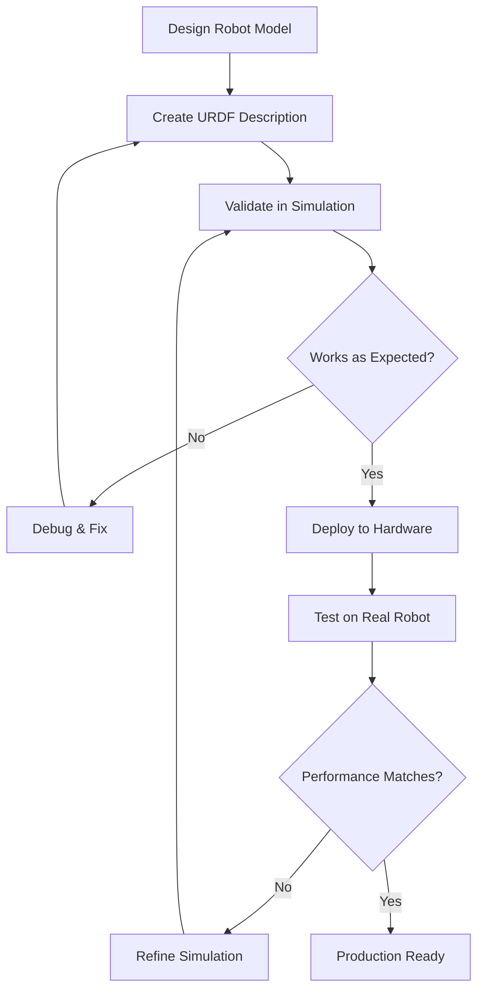

# Simulation Workflows

## Introduction

Simulation is not just about creating pretty visualizations; it's a critical part of the robot development lifecycle. This section covers practical workflows for using simulation in robotics development, from initial prototyping to system validation.

## Development Workflow

### 1. Rapid Prototyping in Simulation

Simulation allows for fast iteration without the risks and costs associated with real hardware:



### 2. Testing Pipeline

A comprehensive testing pipeline should include multiple levels of validation:

1. **Unit Tests**: Test individual components in isolation
2. **Integration Tests**: Test component interactions in simulation
3. **System Tests**: Test complete robot behavior in simulation
4. **Hardware Validation**: Validate on real robot

## Practical Example: Navigation Stack Testing

Here's a complete example of how to test a navigation stack in simulation:

### 1. Simulation Environment Setup

First, create a launch file that sets up the complete navigation stack in simulation:

```python
# navigation_simulation.launch.py
import os
from launch import LaunchDescription
from launch.actions import DeclareLaunchArgument, IncludeLaunchDescription, GroupAction
from launch.launch_description_sources import PythonLaunchDescriptionSource
from launch.substitutions import LaunchConfiguration, PathJoinSubstitution
from launch_ros.actions import Node, PushRosNamespace
from launch_ros.substitutions import FindPackageShare


def generate_launch_description():
    # Launch arguments
    use_sim_time = LaunchConfiguration('use_sim_time', default='true')
    map_file = LaunchConfiguration('map', default='maze.yaml')
    nav_params_file = LaunchConfiguration('params', default='nav2_params.yaml')
    world = LaunchConfiguration('world', default='maze.sdf')

    # Simulation environment
    gazebo_sim = IncludeLaunchDescription(
        PythonLaunchDescriptionSource([
            PathJoinSubstitution([
                FindPackageShare('gazebo_ros'),
                'launch',
                'gazebo.launch.py'
            ])
        ]),
        launch_arguments={
            'world': PathJoinSubstitution([FindPackageShare('my_robot_gazebo'), 'worlds', world]),
            'verbose': 'false',
        }.items()
    )

    # Robot state publisher
    robot_state_publisher = Node(
        package='robot_state_publisher',
        executable='robot_state_publisher',
        parameters=[
            {'use_sim_time': use_sim_time},
            {'robot_description': open(
                PathJoinSubstitution([FindPackageShare('my_robot_description'), 'urdf', 'my_robot.urdf'])
            ).read()}
        ]
    )

    # Spawn robot
    spawn_robot = Node(
        package='gazebo_ros',
        executable='spawn_entity.py',
        arguments=[
            '-topic', 'robot_description',
            '-entity', 'my_robot',
            '-x', '0.0',
            '-y', '0.0',
            '-z', '0.0'
        ],
        parameters=[{'use_sim_time': use_sim_time}],
        output='screen'
    )

    # Navigation stack
    navigation_stack = IncludeLaunchDescription(
        PythonLaunchDescriptionSource([
            PathJoinSubstitution([
                FindPackageShare('nav2_bringup'),
                'launch',
                'navigation_launch.py'
            ])
        ]),
        launch_arguments={
            'use_sim_time': use_sim_time,
            'params_file': nav_params_file
        }.items()
    )

    # Map server
    map_server = Node(
        package='nav2_map_server',
        executable='map_server',
        parameters=[
            {'use_sim_time': use_sim_time},
            {'yaml_filename': PathJoinSubstitution([FindPackageShare('my_robot_navigation'), 'maps', map_file])}
        ]
    )

    # Lifecycle manager
    lifecycle_manager = Node(
        package='nav2_lifecycle_manager',
        executable='lifecycle_manager',
        parameters=[
            {'use_sim_time': use_sim_time},
            {'autostart': True},
            {'node_names': [
                'map_server',
                'planner_server',
                'controller_server',
                'behavior_server',
                'bt_navigator',
                'waypoint_follower'
            ]}
        ]
    )

    return LaunchDescription([
        DeclareLaunchArgument('use_sim_time', default_value='true', description='Use simulation time'),
        DeclareLaunchArgument('map', default_value='maze.yaml', description='Map file to load'),
        DeclareLaunchArgument('params', default_value='nav2_params.yaml', description='Navigation parameters file'),
        DeclareLaunchArgument('world', default_value='maze.sdf', description='World file to load'),

        gazebo_sim,
        robot_state_publisher,
        spawn_robot,
        navigation_stack,
        map_server,
        lifecycle_manager
    ])
```

### 2. Automated Testing Script

Create a Python script to automatically test navigation capabilities:

```python
#!/usr/bin/env python3
"""
Automated navigation testing script for simulation
"""

import rclpy
from rclpy.action import ActionClient
from rclpy.node import Node
from geometry_msgs.msg import PoseStamped
from nav2_msgs.action import NavigateToPose
from std_msgs.msg import String
import time
import json


class NavigationTester(Node):
    def __init__(self):
        super().__init__('navigation_tester')

        # Create action client for navigation
        self.nav_client = ActionClient(self, NavigateToPose, 'navigate_to_pose')

        # Test waypoints
        self.test_waypoints = [
            {'x': 1.0, 'y': 1.0, 'theta': 0.0},
            {'x': 2.0, 'y': 2.0, 'theta': 1.57},
            {'x': 0.0, 'y': 3.0, 'theta': 3.14},
            {'x': -1.0, 'y': 1.0, 'theta': -1.57}
        ]

        # Results tracking
        self.test_results = []

        # Wait for navigation server
        self.nav_client.wait_for_server()

    def send_goal(self, x, y, theta):
        """Send navigation goal to the robot."""
        goal_msg = NavigateToPose.Goal()
        goal_msg.pose.header.frame_id = 'map'
        goal_msg.pose.header.stamp = self.get_clock().now().to_msg()

        goal_msg.pose.pose.position.x = x
        goal_msg.pose.pose.position.y = y
        goal_msg.pose.pose.position.z = 0.0

        # Convert theta to quaternion
        from math import sin, cos
        goal_msg.pose.pose.orientation.z = sin(theta / 2.0)
        goal_msg.pose.pose.orientation.w = cos(theta / 2.0)

        # Send goal and wait for result
        self.get_logger().info(f'Sending goal: ({x}, {y}, {theta})')
        future = self.nav_client.send_goal_async(goal_msg)
        return future

    def run_navigation_test(self):
        """Run the complete navigation test sequence."""
        self.get_logger().info('Starting navigation test sequence...')

        for i, waypoint in enumerate(self.test_waypoints):
            self.get_logger().info(f'Test {i+1}/{len(self.test_waypoints)}: Navigating to ({waypoint["x"]}, {waypoint["y"]})')

            # Send goal
            future = self.send_goal(waypoint['x'], waypoint['y'], waypoint['theta'])

            # Wait for result (with timeout)
            start_time = time.time()
            while not future.done() and (time.time() - start_time) < 60:  # 60 second timeout
                rclpy.spin_once(self, timeout_sec=0.1)

            if future.done():
                result = future.result()
                success = result.result.result.status == 3  # Assuming status 3 means success

                test_result = {
                    'waypoint': waypoint,
                    'success': success,
                    'time_taken': time.time() - start_time
                }

                self.test_results.append(test_result)

                if success:
                    self.get_logger().info(f'✓ Waypoint {i+1} reached successfully in {test_result["time_taken"]:.2f}s')
                else:
                    self.get_logger().error(f'✗ Waypoint {i+1} failed to reach')
            else:
                # Timeout
                test_result = {
                    'waypoint': waypoint,
                    'success': False,
                    'time_taken': 60.0
                }
                self.test_results.append(test_result)
                self.get_logger().error(f'✗ Waypoint {i+1} timed out')

        # Print final results
        self.print_test_summary()

    def print_test_summary(self):
        """Print summary of test results."""
        total_tests = len(self.test_results)
        successful_tests = sum(1 for result in self.test_results if result['success'])
        success_rate = (successful_tests / total_tests) * 100 if total_tests > 0 else 0

        self.get_logger().info('\n' + '='*50)
        self.get_logger().info('NAVIGATION TEST SUMMARY')
        self.get_logger().info('='*50)
        self.get_logger().info(f'Total tests: {total_tests}')
        self.get_logger().info(f'Successful: {successful_tests}')
        self.get_logger().info(f'Success rate: {success_rate:.1f}%')

        if total_tests > 0:
            avg_time = sum(result['time_taken'] for result in self.test_results) / total_tests
            self.get_logger().info(f'Average time: {avg_time:.2f}s')

        # Save results to file
        with open('/tmp/navigation_test_results.json', 'w') as f:
            json.dump(self.test_results, f, indent=2)

        self.get_logger().info('Results saved to /tmp/navigation_test_results.json')
        self.get_logger().info('='*50)


def main(args=None):
    rclpy.init(args=args)

    tester = NavigationTester()

    # Run the test
    tester.run_navigation_test()

    # Shutdown
    tester.destroy_node()
    rclpy.shutdown()


if __name__ == '__main__':
    main()
```

## Performance Comparison: Simulation vs. Reality

### 1. Validation Metrics

When comparing simulation to real-world performance, consider these metrics:

- **Trajectory Accuracy**: How closely does the simulated path match the real path?
- **Timing**: Do operations take the same relative time in both environments?
- **Sensor Data Quality**: Do simulated sensors produce data similar to real sensors?
- **Failure Modes**: Do the same failure conditions occur in both environments?

### 2. Domain Randomization

To make simulation results more applicable to the real world, use domain randomization:

```python
# Example: Randomizing physics parameters in simulation
import random

class DomainRandomization:
    def __init__(self):
        self.parameters = {
            'friction': (0.1, 0.9),      # Range of friction values
            'mass_variance': (0.9, 1.1), # Mass multiplier range
            'sensor_noise': (0.0, 0.1),  # Sensor noise range
            'latency': (0.0, 0.1)        # Communication delay range
        }

    def randomize_parameters(self):
        """Generate random parameters for simulation."""
        randomized = {}
        for param, (min_val, max_val) in self.parameters.items():
            randomized[param] = random.uniform(min_val, max_val)
        return randomized

    def apply_to_simulation(self, sim_interface, params):
        """Apply randomized parameters to simulation."""
        # Apply friction randomization
        sim_interface.set_friction(params['friction'])

        # Apply mass variations
        sim_interface.set_mass_multiplier(params['mass_variance'])

        # Apply sensor noise
        sim_interface.set_sensor_noise(params['sensor_noise'])

        # Apply communication latency
        sim_interface.set_communication_latency(params['latency'])
```

## Best Practices

1. **Start Simple**: Begin with basic simulations and gradually add complexity
2. **Validate Early**: Compare simulation and real robot behavior as early as possible
3. **Document Differences**: Keep track of known differences between simulation and reality
4. **Use Real Sensor Data**: When possible, inject real sensor data into simulation
5. **Test Edge Cases**: Use simulation to test dangerous or difficult real-world scenarios
6. **Performance Profiling**: Monitor simulation performance to ensure realistic timing

## Troubleshooting Common Issues

1. **Physics Instability**: Adjust solver parameters and time steps
2. **Sensor Discrepancies**: Calibrate sensor models and add realistic noise
3. **Timing Issues**: Ensure `use_sim_time` is properly configured
4. **TF Tree Problems**: Verify coordinate frame relationships
5. **Plugin Issues**: Check plugin configurations and dependencies

Simulation is a powerful tool that, when used correctly, can significantly accelerate robot development while reducing costs and risks.